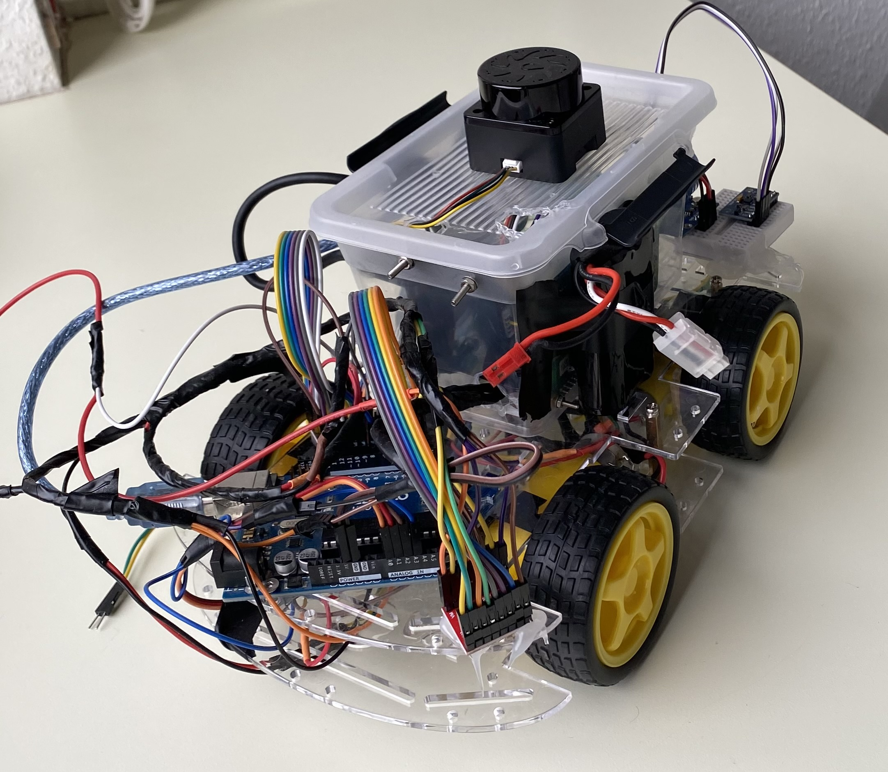
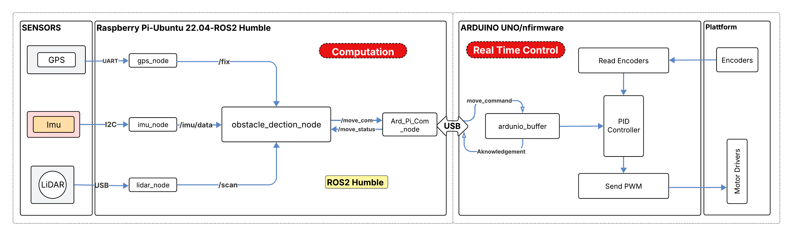

# SmartCar- ROS2 Autonomous Mobile Platform under active development

# System Architecture

# Hardware Layout

# System Schematic

# Goals
- Develop a ROS2-based autonomous platform
- Multi-sensor fusion (LiDAR + IMU + GPS)
- Design software architecture
- Reproducible hardware-software integration

# Current Capabilities
- Motor control via Arduino + ROS2 interface
- Encoder-based velocity estimation
- Integration IMU, LiDAR, GPS
- Basic obstacle detection

# In Progress
- Sensor fusion
- Robust obstacle avoidance logic
- Nav2 integration
- Autonomous waypoint navigation

# BOM
Simple table:
| NO. | Component         | Model             | QTY  | Unit Cost(€) | Total(€) |
| --- | -------------     | -------------     | ---- | ------------ | -------- |
|  1  | Rasberry Pi       | 4B 8G             |   1  |      116     |    116   |
|  2  | GPS               | GY-NEO6MV2        |   1  |      7,59    |    7,59  |
|  3  | Imu               | MPU9250-9Achsen   |   1  |      10,19   |   10,19  |
|  4  | LiDAR             | YDLIDAR Tmini Plus|   1  |      79      |    79    |
|  5  | Microcontroller   | Arduino Uno r3    |   1  |      23,6    |    23,6  |
|  6  | Connector         | USB2.0(Arduino)   |   1  |      2,98    |    2,98  |
|  7  | Speed Sensor      | F249 LM393        |   4  |      2,1     |    8,4   |
|  8  | Motor Driver      | TB6612FNG         |   2  |      5,99    |    11,98 |
|  9  | Platform Structure| 4WD Smart Car     |   1  |      14,99   |    14,99 |
| 10  | Power Bank        | 30000mah          |   1  |      35      |    35    |
| 11  | Battery           | 3000mah           |   1  |      19,99   |    19,99 |
|     |  Total            |                   |      |              |    329,72|

# Wiring Diagram
For detailed wiring digrams, refer to /hardwar/Wiring Diagrams

# Installations
1. Install Ubuntu 22.04
2. Install ROS2 Humble
