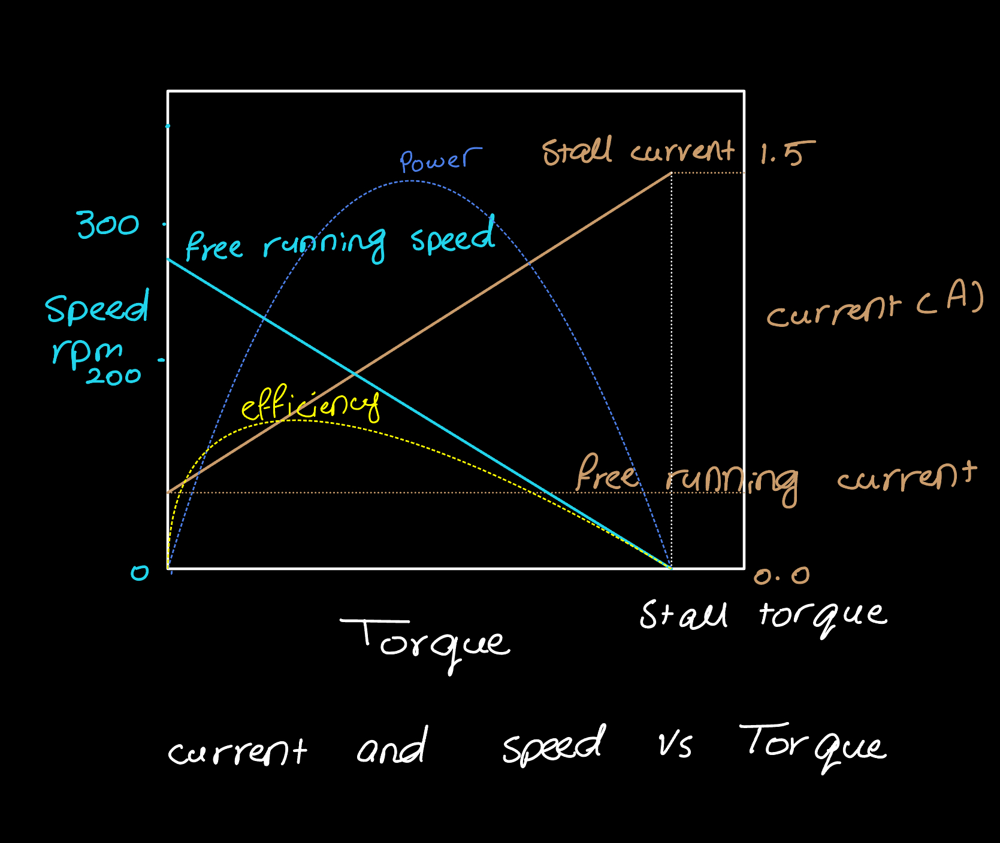

# Octobus-SmartCar
The Octobus is 4WD smart car that integrates 3 sensors(LiDAR, GPS and Imu) to navigate from  coordniate A to B while avoid obsctacles between them. The mobile robot uses Rasberry Pi 4B and ROS2 nodes to enable autonomous navigation. An arduino Uno controls the Octobus 4 wheels via PID Controller.

