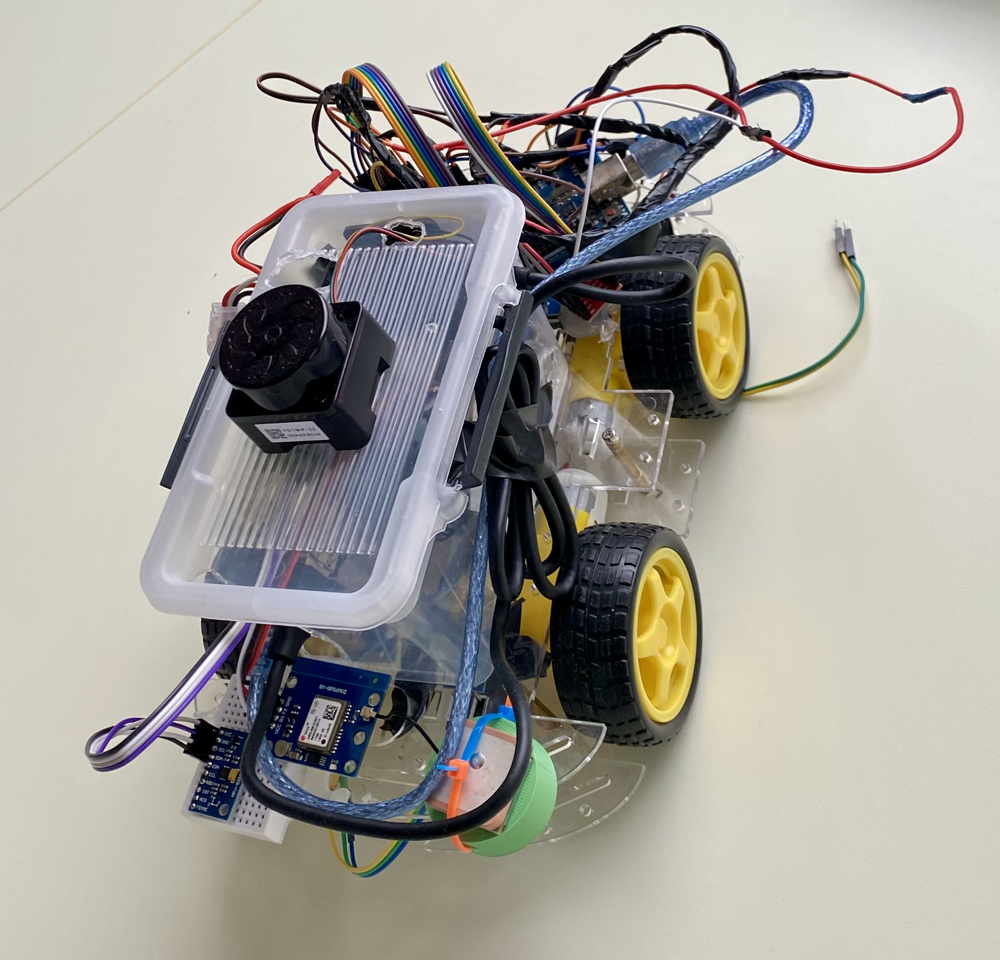
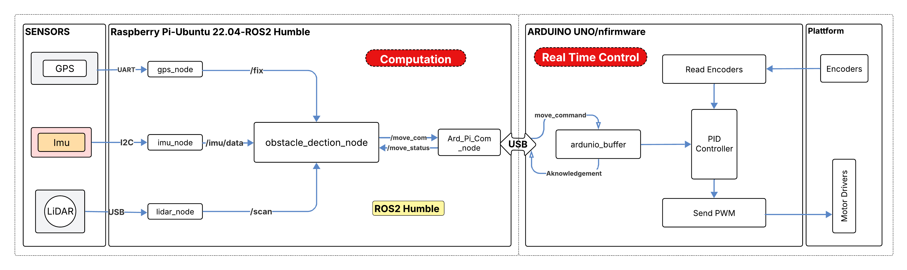
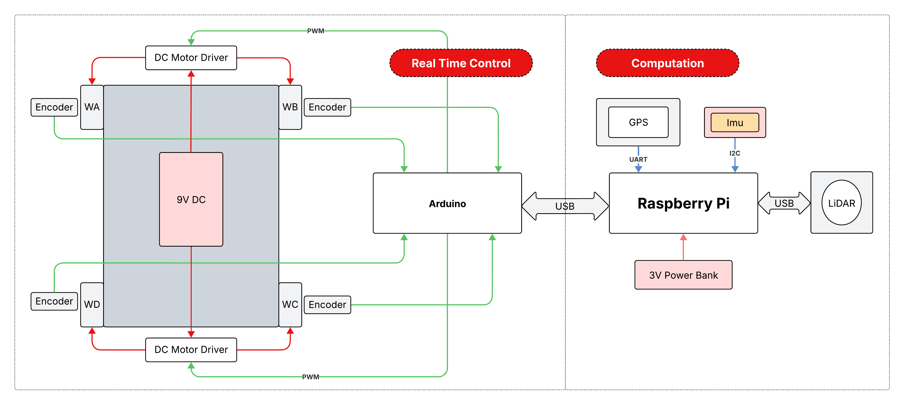
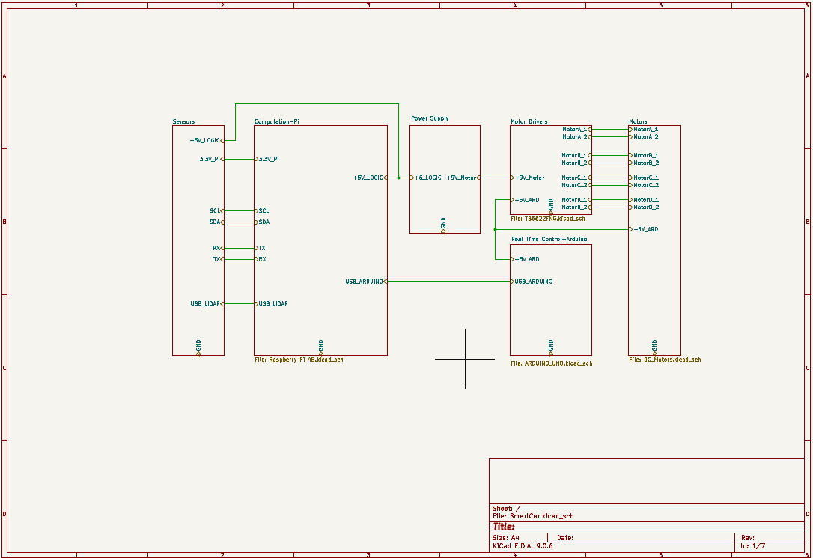

# SmartCar

# System Architecture

# Hardware Layout

# System Schematic

# Goals
- Design of ROS2 Autonomous Mobile System that could be:   
    - Reproduced and scaled  
    - Developed   
- Sensor Integgeration( LiDAR, Imu, GPS)   
- Obstacle detection and avoidance   
- Autonomous path planning and navigation 

# Current Status
- Successful integeration of the system components   
- Mobility via ROS2 Nodes, e.g forward, backward, right or left   
- Autonomous Obsatcle detection and avoidance   

# Integeration Test Demo
https://github.com/user-attachments/assets/1bf3dcbe-58a1-4a5d-b76c-9af76d147cb6

# Wiring Diagram

# BOM
| NO. |  Component	      |  Model             | QTY | Unit Cost(€) |Total(€)|
|-----|--------------     |-------             |---  |-----         |-----   |
| 1	  | Rasberry Pi       | 4B 8G	           |  1  |     116	    |  116   |
| 2   |	GPS	              | GY-NEO6MV2         |  1  |     7,59     |  7,59  |
| 3	  | Imu	              | MPU9250-9Achsen    |  1  |     10,19	|  10,19 |
| 4	  | LiDAR	          | YDLIDAR Tmini Plus |  1  |     79	    |  79    |
| 5	  | Microcontroller   | Arduino Uno r3	   |  1  |     23,6     |  23,6  |
| 6	  | Connector	      | USB2.0(Arduino)	   |  1  |     2,98     |  2,98  |
| 7	  | Speed Sensor      | F249 LM393	       |  4  | 	   2,1	    |  8,4   |
| 8	  | Motor Driver      | TB6612FNG	       |  2  | 	   5,99	    |  11,98 |
| 9	  | Platform Structure|	4WD Smart Car	   |  1	 |     14,99    |  14,99 |
| 10  | Power Bank	      | 30000mah	       |  1	 |     35	    |  35    |
| 11  |	Battery	          | 3000mah	           |  1	 |     19,99    |  19,99 |
|     |                   |                    |     |    Toatal    | 329,72 |

# Installations
 - Ubuntu 22.04   
 - ROS2 Humble 
